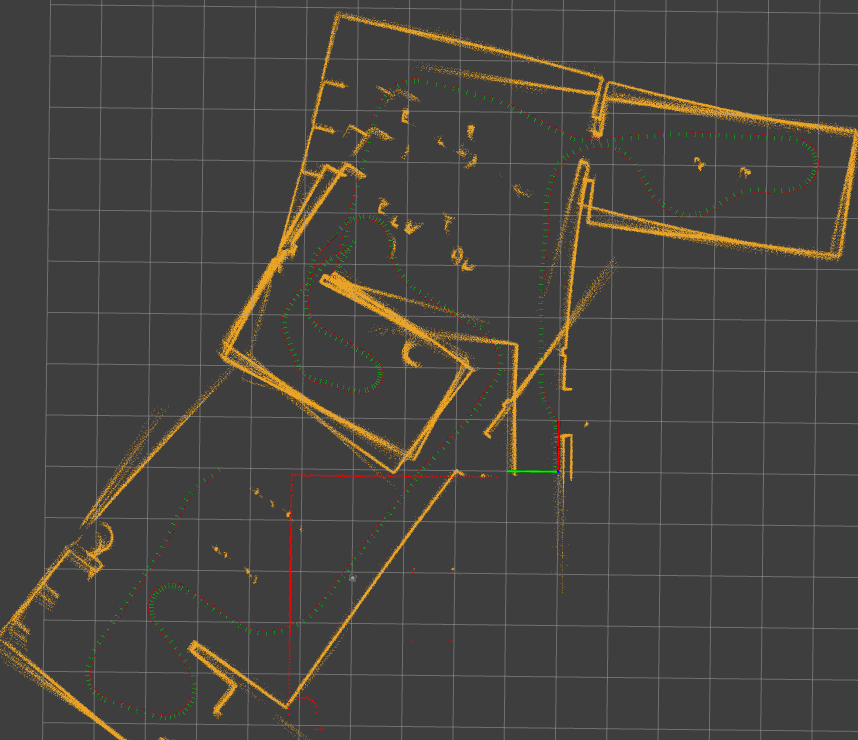

# simple_slam_2d

naive ICP scan matching SLAM written in Rust.

## dependencies

- rustc == 1.64.0
- [ros2_rust](https://github.com/ros2-rust/ros2_rust)
- [turtlebot3_custom](https://github.com/soblin/turtlebot3_nav)

## online mapping

1. Launch the simulator

```
ros2 launch simple_slam_2d sim.launch
```

2. Move the robot

```
ros2 run turtlebot3_multi_nav teleop_keyboard.py --ros-args -p robot_namespace:=burger1 trans_cmd_noise:=0.1 rot_cmd_noise:=0.1
```

We can get the "intended" cmd_vel from `/cmd_vel_raw`, but noised value is published to `/cmd_vel` and used by gazebo to simulate input noise to the robot.
Basically `simple_slam_2d` node should not have access to `/cmd_vel`, but only to `/cmd_vel_raw`. In this case, `v` and `w` of `/cmd_vel` are multiplied by a ratio which is uniformly distributed between `[0.9, 1.1]`.

3. Run the node

```
ros2 run simple_slam_2d simple_slam_2d OR cargo run
```

## offline mapping

```
ros2 launch simple_slam_2d replay.launch
ros2 run simple_slam_2d simple_slam_2d OR cargo run

```

## input/output

- input
  - sensor_msgs::LaserScan
  - geometry_msgs::Twist
- output
  - sensor_msgs::PointCloud
  - nav_msgs::Odometry

## result

Mapping by odometry


